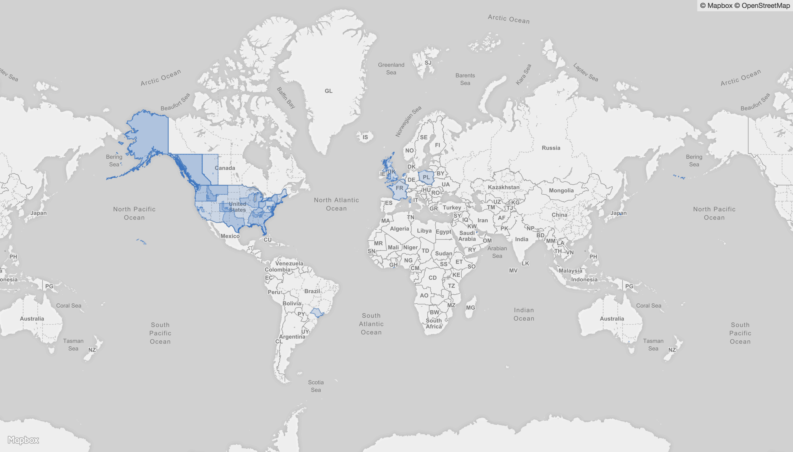

# No Agenda Peerage

> Protectorates of the No Agenda Round Table.

## Add your protectorate to the map

There are three ways to have your protectorate added to the map:

1. Email [peerage@noagendahr.org](mailto:peerage@noagendahr.org)
2. [Submit an issue](https://github.com/NoAgenda/peerage/issues/new)
3. [Fork this repo](https://github.com/NoAgenda/peerage/fork), follow the [contributing guide](.github/CONTRIBUTING.md), and submit a pull request

Make sure to include the following info when emailing or creating an issue:

1. Your name and title
2. The location of your protectorate
3. A link to the segment of the show on [the official show page](https://www.noagendashow.net/archive) for proof

Providing a map of your protectorate is always helpful to make sure that it’s correct.
